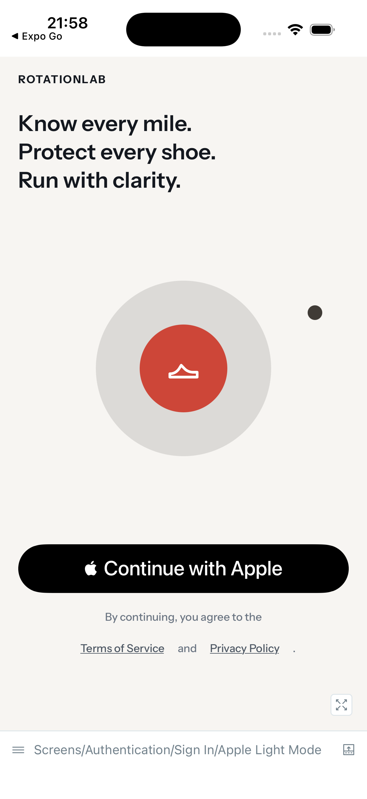
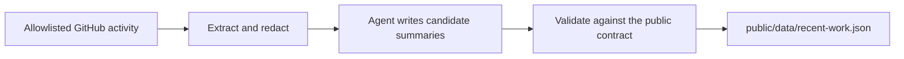

# Personal site

The source for [bradleynichol.co.uk](https://www.bradleynichol.co.uk) — a personal site about backend engineering, design, side projects, and the things I’m learning as I build.

It is deliberately small: semantic HTML, one stylesheet, a little JavaScript, and no build step. The more interesting part is the publishing workflow behind **Recent work**, which turns allowlisted GitHub activity into short, privacy-safe public notes.

[Visit the site →](https://www.bradleynichol.co.uk)

## Current build

The site currently follows the development of **RotationLab**, a mobile product that helps runners understand how their shoes are being used, how far they have gone, and when they may need replacing.

<p align="center">
  <a href="https://www.bradleynichol.co.uk/#current-build">
    
  </a>
</p>

## Recent work, without publishing private work

The homepage includes a compact engineering log generated from selected GitHub activity. Extraction, redaction, validation, and state management stay deterministic; the current coding agent is used only to turn already-sanitised input into plain-language summaries.



The workflow is designed to avoid publishing repository names, source code, paths, branches, identifiers, private terminology, or raw GitHub responses. If a candidate cannot be validated safely, it is not published.

The reusable agent workflow lives in [`skills/publish-recent-work/SKILL.md`](./skills/publish-recent-work/SKILL.md), with deterministic implementation code under [`scripts/activity`](./scripts/activity).

## Repository map

| Area | Purpose |
| --- | --- |
| [`public`](./public) | The deployed static site and public recent-work artifact |
| [`scripts/activity`](./scripts/activity) | Extraction, redaction, validation, state, and publishing commands |
| [`skills/publish-recent-work`](./skills/publish-recent-work) | Reusable workflow for Codex, Claude, or a local scheduler |
| [`tests`](./tests) | Node test coverage for rendering and the activity pipeline |
| [`docs`](./docs) | Design system and repository documentation |

## Run locally

There is no build step. Start any static file server from the repository root:

```bash
python3 -m http.server --directory public
```

Then open [http://localhost:8000](http://localhost:8000).

## Test

The project uses Node’s built-in test runner:

```bash
node --test
```

CI also checks the required static files, shell scripts, and JavaScript syntax.

## Refresh Recent work

For first-time local setup, run:

```bash
bash scripts/activity/setup-local.sh
```

The setup wizard stores configuration outside the repository. After that, run the workflow in [`skills/publish-recent-work/SKILL.md`](./skills/publish-recent-work/SKILL.md). It prepares safe input, lets the current agent produce candidate summaries, validates the result, and writes the accepted artifact to `public/data/recent-work.json`.

Committing or pushing generated work remains an explicit action; the publishing pipeline does not do either by default.
